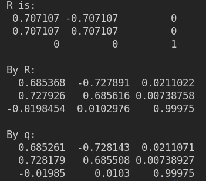

## 第10讲 VIO概述与课程介绍

1.1 视觉slam在快速运动或者图像遮挡、纹理光照等干扰的情况下运动追踪失败可以靠IMU进行定位，从而提高系统的鲁棒性。在运动的过程中如果出现了图像发生巨大变化，可以使用IMU信息来感知自身的运动。通过融合视觉信息和IMU信息，可以对旋转运动进行估计并恢复真实的尺度。而且借助IMU高频率的一个采样，可以提高系统的输出频率。可利用视觉定位信息来估计IMU的零偏，减少IMU由零偏导致的发散和累积误差。

1.2 融合方案：
MSCKF：紧耦合，FAST+光流前端；后端用重投影误差，无回环检测。
OKVIS：紧耦合，前端使用多尺度Harris提取特征点，使用BRISK作为描述子，后端使用ceres进行非线性优化完成状态估计。
ROVIO：紧耦合，基于稀疏图像块的EKF滤波实现VIO，基于单目的，前端是用FAST+光流，后端是EKF滤波。
VINS：紧耦合，前端Harris+光流，有回环检测，通过非线性优化一个滑窗内的KF等。
工业界应用的例子：
（1）VIO 在工业中广泛应用于无人机以及移动机器人的导航，自动驾驶技术中目前也开始增加VIO 的技术使用，目前自动驾驶广泛应用的是 GPS 与 IMU 的组合导航，但是在某些场合场合，GPS 信号弱，不能提供良好的导航效果，于是增加相机与 IMU 的融合。
（2）AR(Augmented Reality) 增强现实技术是通过带有视觉传感器的设备实现在物理真实场景中添加虚拟信息，实现现实和虚拟场景的交互。例如 Apple 的 ARKit 在移动设备上实现的 AR，ARKit是通过 VIO 实现移动设备在空间中的精确定位。
（3）VR(Virtual Reality) 虚拟现实技术则是通过虚拟现实头盔投射虚拟信息，给人身临其境的感觉，将使用者在实际空间中的移动反映到虚拟空间上，可以很大程度地提高交互体验，其中的Inside-out 定位目前广泛采用的方案就是视觉惯性传感器融合实现 SLAM 的 VINS 算法。

1.3 学术界：VINS、VINS-Fusion、 OKVIS等。

2 代码文件见附件，结果如下：

3 推导如下：

