## 第11讲 IMU传感器

1.1 噪声较小的情况

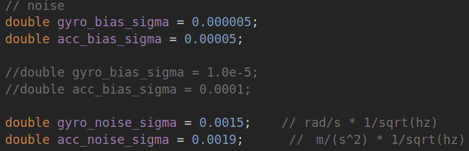

陀螺仪的Allan方差图如下

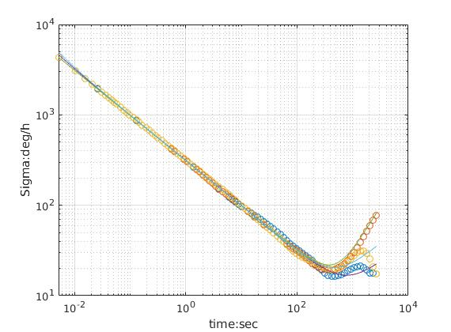

加速度的 Allan 方差图如下

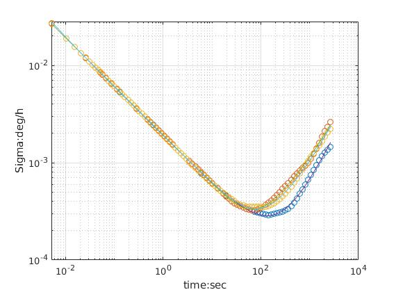

1.2 噪声中等的情况

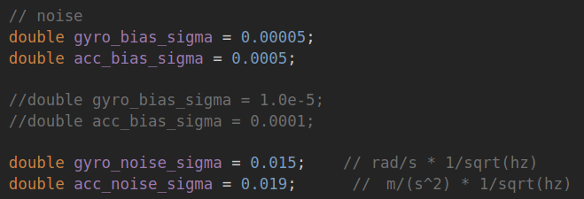

陀螺仪的Allan方差图如下

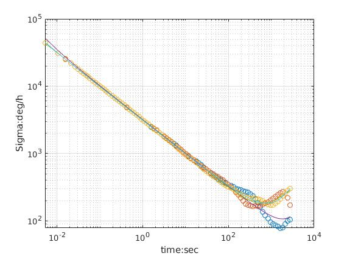

加速度的 Allan 方差图如下

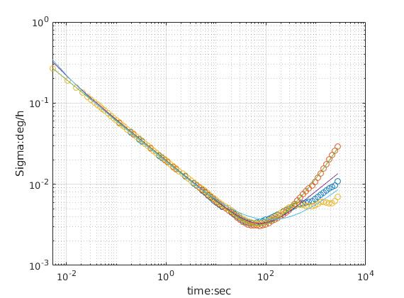

1.3 噪声较大的情况

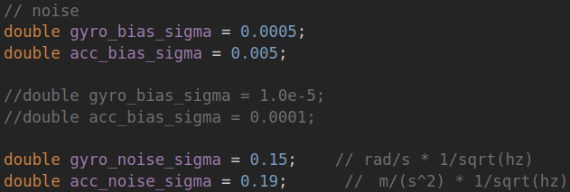

陀螺仪的Allan方差图如下

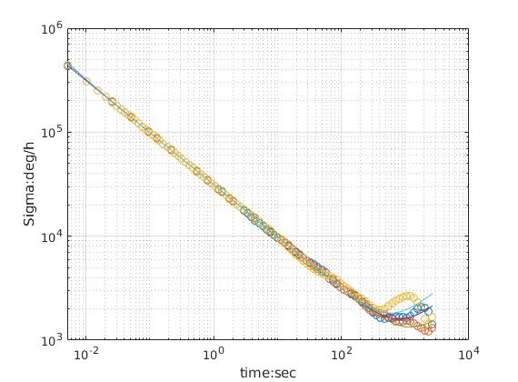

加速度的 Allan 方差图如下

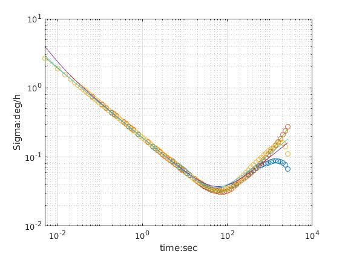

2 将 IMU 仿真代码中的欧拉积分替换成中值积分，代码如下

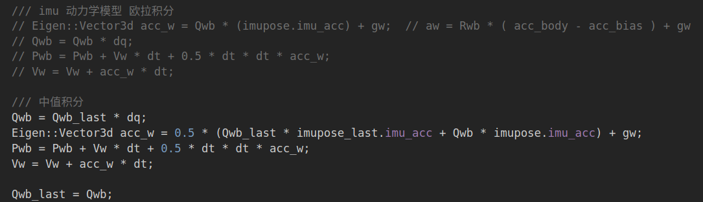

欧拉法仿真结果如下

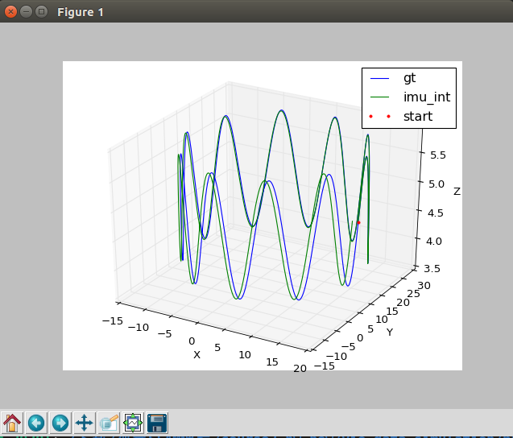

中值法仿真结果如下

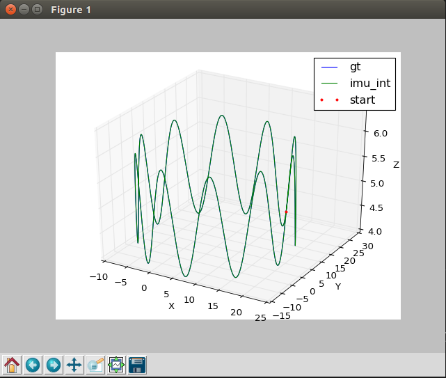