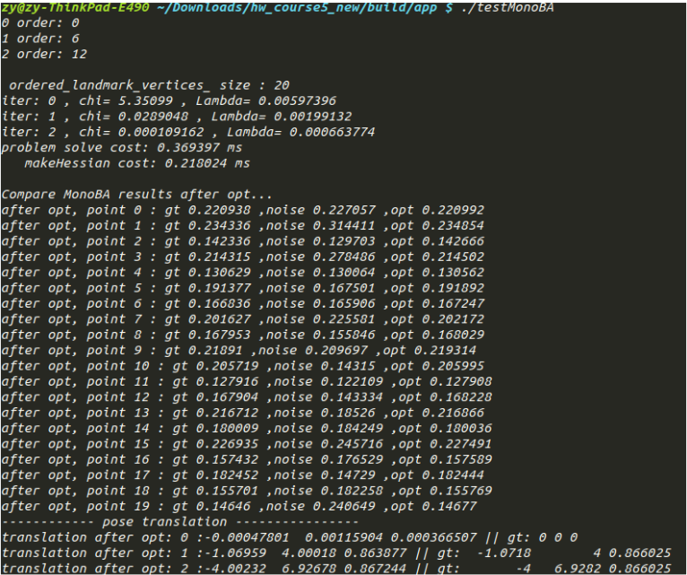
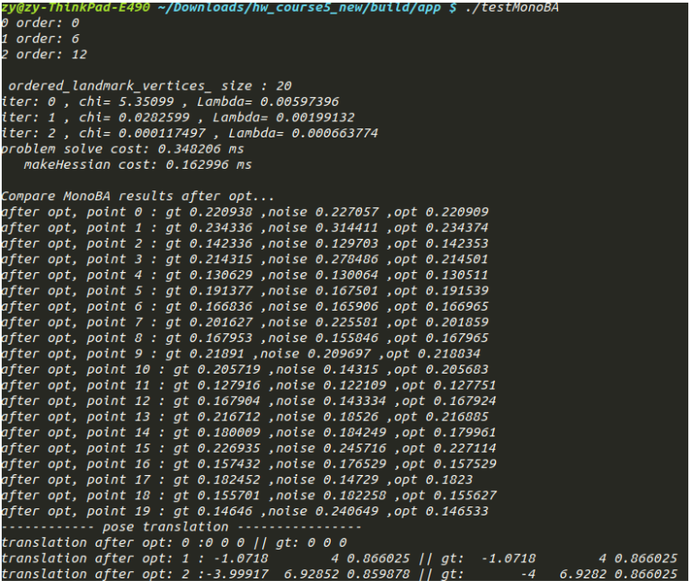
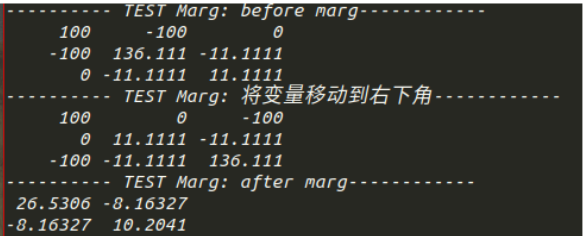

## 第14讲 后端优化实践-逐行手写求解器

1 代码见附件,结果如下
不固定第一帧和第二帧

固定第一帧和第二帧

对比固定第一帧和第二帧前后的优化结果,优化完成后,两种方式得到的空间点的逆深度与真值都很相近,但是,固定前,第一帧相机 pose 的位置不再是 (0, 0, 0) ;而在固定后,使两帧位姿对应的雅克比为0 ,信息矩阵中对应位置的矩阵块也为 0 ,利用 LM 算法求解时,相当于固定了第一帧和第二帧位姿不被优化,也就不会发生改变。
2 结果如下

可以看出,在 marg 变量 V2 之前,变量 V1 与变量 V3 信息矩阵对应位置为 0 ,即 V1 与 V3 关于 V2条件独立,将 V2 移到右下角并 marg 之后,变量 V1 与变量 V3 产生联系,信息矩阵对应位置不再是0 ,即 V2 被 marg 后将信息传递给了 V1 与 V3 。