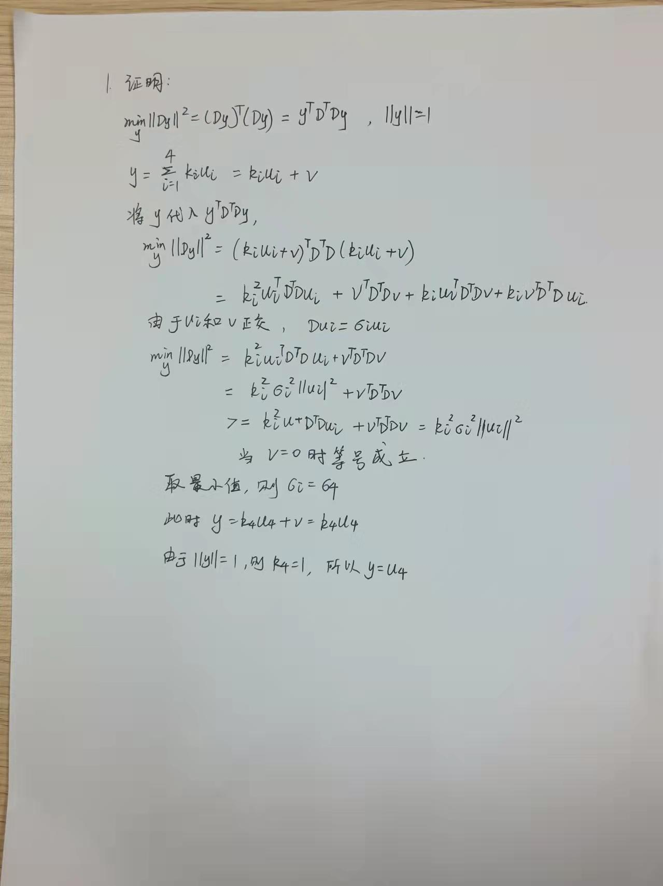
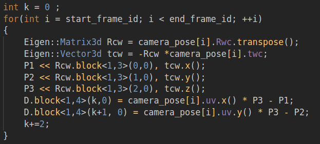
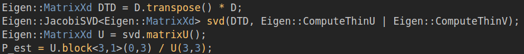
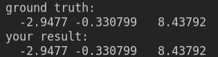
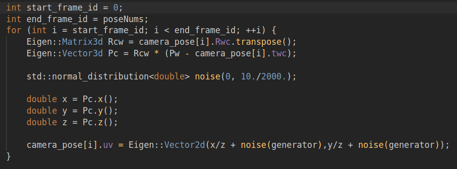
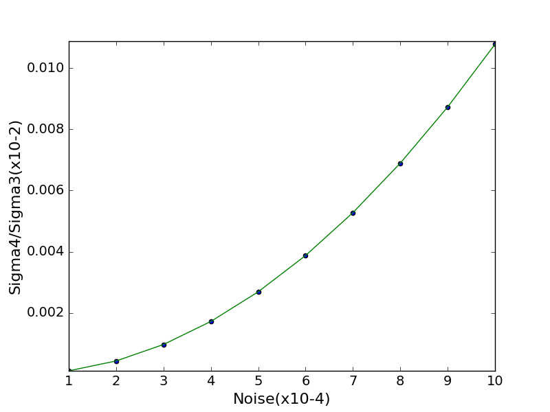
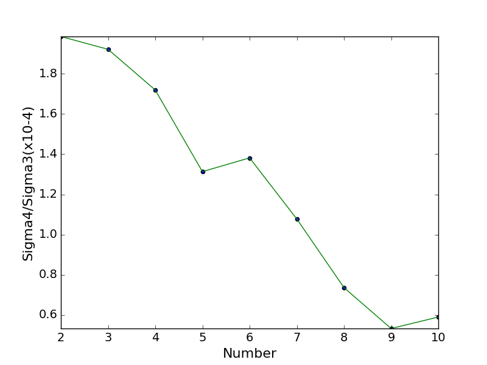

## 第15讲 视觉前端

1 、证明如下

2.1 、代码如下

把相机位姿从世界坐标系变换到相机坐标系,得到投影矩阵 Pk ,并计算矩阵 D

对 DTD 进行 SVD 分解,得到估计值,取齐次坐标的前三维,并同时除以第四维坐标

结果如下

在不加任何噪声的情况下三角化求得的空间点 P_est 与原空间点 Pw 完全相同

3.1 设置噪声如下

结果如下

随着方差的增大, Sigma4/Sigma3 也在不断增大,说明三角化误差越来越大。

3.2 通过修改代码中的变量 start_frame_id 来设置观测帧数,结果如下

可以看出,所有 Sigma4/Sigma3 (最小奇异值和第二小奇异值之间的比例)都在 10-4 量级,三角化都
有效,随着观测帧数的增加, Sigma4/Sigma3 整体呈减小趋势,中间略有波动。