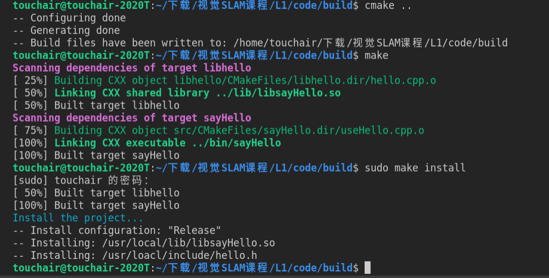
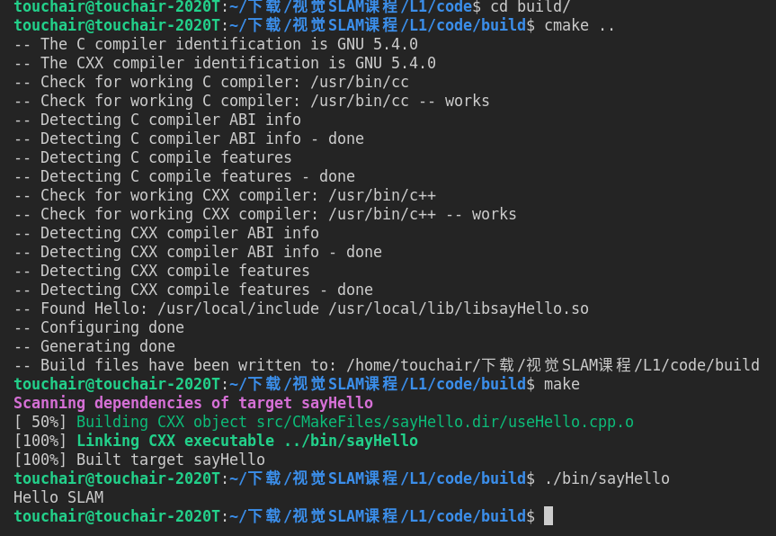
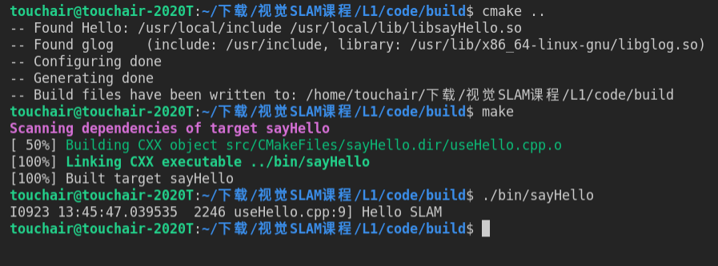
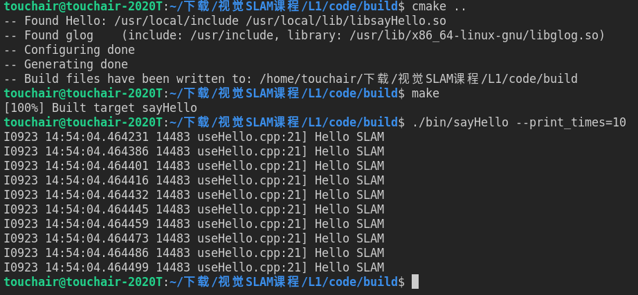
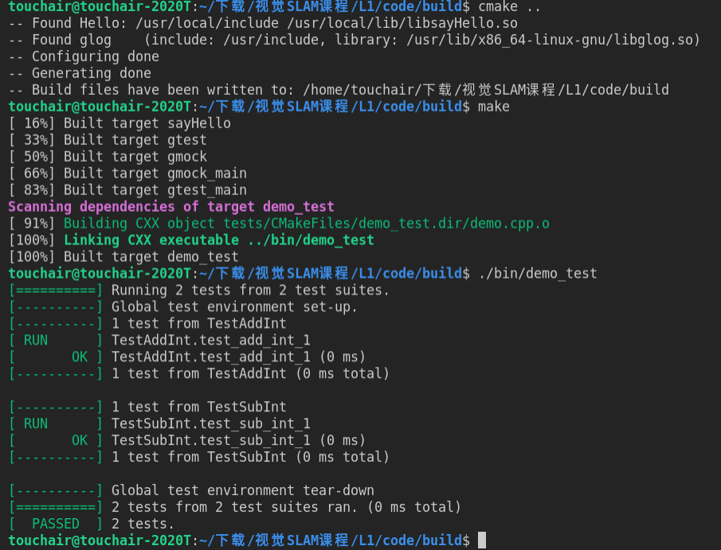
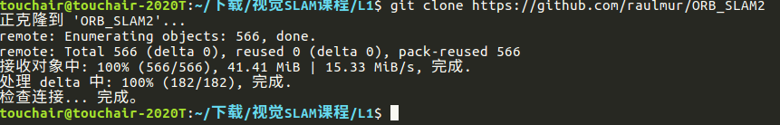
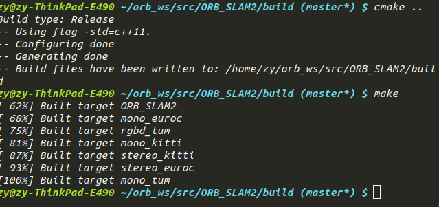
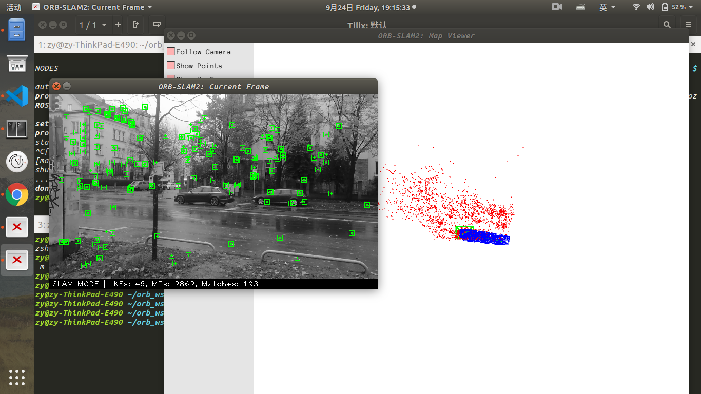

## 第1讲 概述与课程介绍

2.1 Ubuntu通过如下命令安装软件包sudo apt-get install package，一般安装在目录/usr/lib或者/usr/include下

2.2 软件源相当于软件库，通过如下命令 sudo vim /etc/apt/sources.list和sudo apt-get update更换软件源，通过命令 sudo apt-add-repository ppa:ubuntu-xxx/ppa添加软件源，然后执行sudo apt-get update和sudo apt-get install xxx安装软件

2.3 通过git clone 下载安装包源码，通过命令 mkdir build & cd build & cmake .. & make & sudo make install安装，通过sudo dpkg -i xxx.deb 安装deb包 或者通过sudo aptitude install xxx安装

2.4 环境变量用来定义每个用户的操作环境。环境変量是具有一个名字和一个值的参数。它包含了会被系统或者应用使用的信息。LD_LIBRARY_PATH是Linux环境变量名，该环境变量主要用于指定查找共享库（动态链接库）时除了默认路径之外的其他路径。ldconfig 命令的用途,主要是在默认搜寻目录(/lib和/usr/lib)以及动态库配置文件/etc/ld.so.conf内所列的目录下,搜索出可共享的动态 链接库(格式如前介绍,lib*.so*),进而创建出动态装入程序(ld.so)所需的连接和缓存文件.缓存文件默认为 /etc/ld.so.cache,此文件保存已排好序的动态链接库名字列表

2.5 文件权限有可读，可写，可执行三种，通过命令sudo chmod XXX file更改文件权限

2.6 分为三种类型的角色:超级用户（管理员）：享有最高权限，具备系统中的所有权限（一般为root；普通用户：有权限限制，只能对自己目录下的文件进行操作，可以登录系统，UID>=500；系统用户:别称“伪用户”，无法登录系统，一般系统默认持有如bin,nobody等，其主要作用是支撑系统运行，方便系统管理，UID为1-499（闭区间）。用户组来分类，可以分为私有用户组（基本组）和普通用户组（附加组）

2.7 Linux下常见的C++编译器有Code::Blocks，CLion，Visual Studio Code，KDevelop，默认用的是VSCode，支持C++14标准

3.1 SLAM用处

1）增强现实应用: AR通过电脑技术，将虚拟的信息应用到真实世界，真实的环境和虚拟的物体实时地叠加到了同一个画面或空间同时存在。这一画面的实现，离不开SLAM技术的实时定位。虽然在AR行业有很多可代替技术，但SLAM技术是最理想的定位导航技术。相较于SLAM在机器人、无人驾驶等领域的应用，在AR行业的应用则有很多不同点。

2）无人机: 无人机在飞行的过程中需要知道哪里有障碍物，该怎么规避，怎么重新规划路线。显然，这是SLAM技术的应用。但无人机飞行的范围较大，所以对精度的要求不高，市面上其他的一些光流、超声波传感器可以作为辅助。

3）自动驾驶: 随着城市物联网和智能系统的完善，无人驾驶必是大势所趋。无人驾驶利用激光雷达传感器（Velodyne、IBEO等）作为工具，获取地图数据，并构建地图，规避路程中遇到的障碍物，实现路径规划。跟SLAM技术在机器人领域的应用类似，只是相比较于SLAM在机器人中的应用，无人驾驶的雷达要求和成本要明显高于机器人。
4）机器人: 激光+SLAM是目前机器人自主定位导航所使用的主流技术。激光测距相比较于图像和超声波测距，具有良好的指向性和高度聚焦性，是目前最可靠、稳定的定位技术。激光雷达传感器获取地图信息，构建地图，实现路径规划与导航。机器人可以应用的地方很多，比如配送机器人，探索机器人等。

3.2 定位与建图的关系：整个SLAM过程中，移动机器人一方面要明白自身的状态（即定位），另一方面又需要了解外在的环境（即建图）。两者紧密相关。建图的准确性依赖于定位精度，而定位的实现又离不开精确的建图。为什么定位的同时需要建图：SLAM强调在未知环境下进行整个过程，如果在未知环境下进行定位，首先需要能够识别并理解周围的环境。再利用环境中的外部信息作为定位的基准，所以需要对所处的环境进行建图。

3.3 SLAM最早由Smith、Self和Cheeseman于1988年提出。SLAM的发展可以大致分为三个阶段：1）朴素时期：classical age（1986-2004）。classical age出现了SLAM最基本的概率公式，包括基于扩展卡尔曼滤波器(EKF)，Rao-Blackwellised粒子滤波器和最大似然估计的方法。此外，它还剔除了与效率以及鲁棒数据等相关的基本问题，这也是日后的发展方向。
 2）算法分析时期：algorithmic-analysis age（2004-2015），这一时期研究了SLAM的基本特性，包括可观察性，收敛性，一致性以及稀疏性对SLAM高效求解的关键作用，主要的开源SLAM库在这个时期得到了开发。
 3）鲁棒性-预测性时代:  robust-perception（2015-至今）：这一时期主要探索SLAM在位置环境中对鲁棒性、高级别的场景理解，计算资源优化，任务驱动的环境感知等。
视觉SLAM是在传统SLAM的基础上发展起来的，早期的视觉SLAM多采用扩展卡尔曼滤波等手段来优化相机位姿的估计和地图构建的准确性，后期随着计算能力的提升及算法的改进，BA优化、位姿优化等手段逐渐成为主流。随着人工智能技术的普及，基于深度学习的SLAM越来越受到研究者的关注。

3.4 前端提取传感器数据构建模型用于状态估计，后端根据前端提供的数据进行优化。

3.5  
    1）MonoSLAM real-time single camera SLAM：第一个实时的单目视觉SLAM系统
    2）ORB-SLAM2: 当前应用最多基于优化的视觉SLAM方法，系统框架非常完
    3）MSCKF: 基于滤波的视觉SLAM方法，由于优秀的计算量和精度得到了实际应用

4.1- 4.5 源代码见文件，运行结果截图如下






5.1
gflags安装：
git clone https://github.com/gflags/gflags.git
cd gflags
mkdir build && cd build
cmake -DCMAKE_INSTALL_PREFIX=/usr/local -DBUILD_SHARED_LIBS=ON -DGFLAGS_NAMESPACE=gflags ../ 
make -j4
sudo make install

glog安装：
sudo apt-get install autoconf automake libtool
git clone https://github.com/google/glog
./autogen.sh
./configure
make -j8
sudo make install

gtest安装：
下载：https://github.com/google/googletest/archive/release-1.8.1.tar.gz 
tar -xzvf googletest-release-1.8.1.tar.gz
cd  googletest-master
cmake .
sudo make 
sudo make install

5.2 运行结果截图如下



5.3 运行结果截图如下



5.4 运行结果截图如下



6.1 下载截图如下:




6.2 a 编译后会生成6个可执行文件：
rgbd_tum
stereo_kitti
stereo_euroc
mono_tum
mono_kitti
mono_euroc
19个库文件： lib*.so
6.2 b Example 存放运行例子的可执行文件，src存放库文件，include存放头文件
6.2 c 可执行文件链接的第三方库有：
OpenCV
EIGEN3
Pangolin
DBoW2
g2o
生成库： libORB_SLAM2.so

7.1 编译截图如下



7.2 CMakeLists修改如下
```
set(CMAKE_RUNTIME_OUTPUT_DIRECTORY ${PROJECT_SOURCE_DIR}/Examples/myvideo) add_executable(myvideo Examples/myvideo/myvideo.cpp) target_link_libraries(myvideo ${PROJECT_NAME})
```

7.3 运行结果如下

