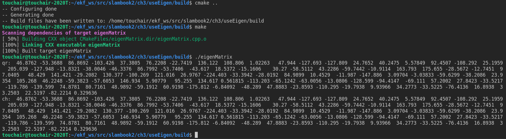
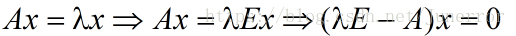
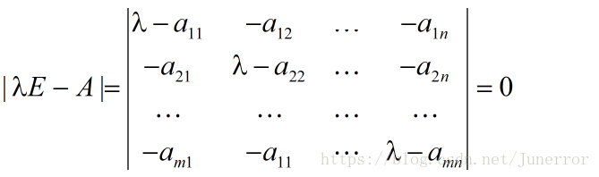
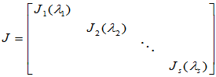
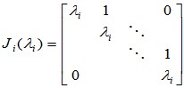
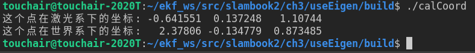
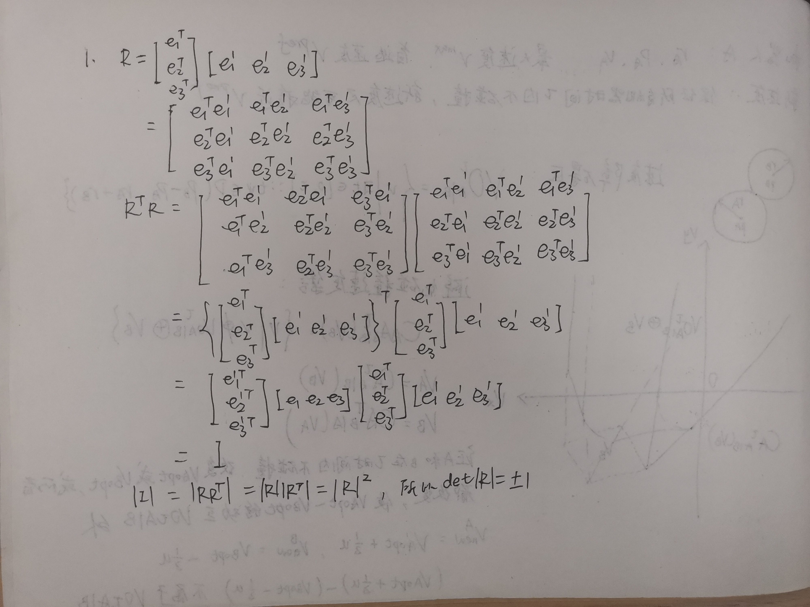
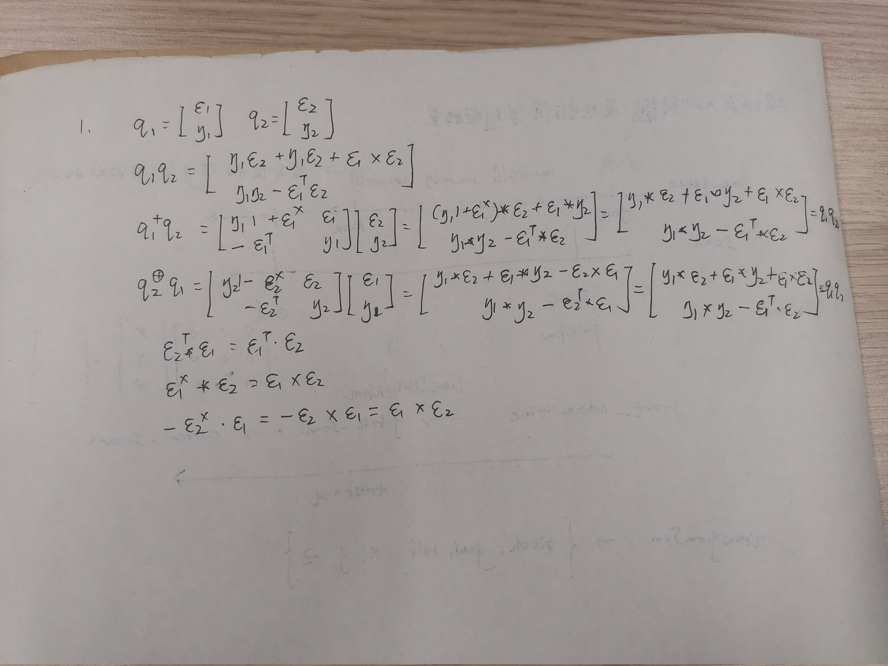

## 第2讲 三维空间的刚体运动

2.1 当A为方阵且可逆
2.2 通过逐步消除未知数来将原始线性系统转化为另一个更简单的等价的系统
2.3 将A分解成正交矩阵和上三角矩阵的乘积A=QR，易解Rx=Q^Tb
2.4 cholesky分解是把一个对称正定的矩阵表示成一个下三角矩阵L和其转置的乘积的分解
2.5 结果截图如下

3.1 给定一个大小为n*n的实对称矩阵A，若对于任意长度为 n 的非零向量 X，有XTAX>0恒成立，则矩阵 A 是一个正定矩阵；给定一个大小为n*n的实对称矩阵A，若对于任意长度为 n 的非零向量 X，有XTAX>=0恒成立，则矩阵 A 是一个半正定矩阵。
3.2 设A为n阶实方阵，如果存在某个数及某个n维非零列向量，使得，则称是方阵A的一个特征值，是方阵A的属于特征值的一个特征向量。特征值不一定是实数，通过以下式子构建方程求解特征值。

3.3 相似的矩阵是同一个线性变换在不同基/坐标系下的的不同描述。对于同一个向量，选取的基底不同，其所对应的坐标值就不同。
3.4 矩阵不一定能够对角化，n*n阶矩阵A可对角化的充分必要条件是矩阵A有n个线性无关的特征向量。Jordan标准形如下

3.5 一个m×𝑛的实数矩阵A，我们想要把它分解成如下的形式 A=𝑈Σ𝑉𝑇，其中U和V均为单位正交阵，即有UU𝑇=I和VVT=I，𝑈称为左奇异矩阵，𝑉称为右奇异矩阵，Σ仅在主对角线上有值，称它为奇异值，其它元素均为0。
3.6 伪逆矩阵A+的极限形式定义：A+=limA∗(A∗A+δI)−1，伪逆矩阵更加常用的定义（基于SVD奇异值分解）：SVD公式：A=UΣV∗伪逆矩阵公式：A+=VΣ+U∗。
3.7(a)  x=(ATA)-1ATb
4.1 激光传感器下看到的点左乘激光传感器相对世界坐标系下的变换矩阵。
4.2 结果截图如下

5.1 证明如下

5.2 ε 的维度为 3， η的维度为 1
5.3 证明如下

8
第9行：使用了初始化列表来初始化字段；
第15行：使用了初始化列表来初始化对象： C++11 把初始化列表的概念绑定到了类型上，并将其称之为 std::initializer_list，允许构造函数或其他函数像参数一样使用初始化列表，这就为类对象的初始化与普通数组和 POD 的初始化方法提供了统一的桥梁;
第16行：使用了lambda表达式来比较元素大小，其中：const A&a1, const A&a2是参数列表，return a1.index<a2.index;是函数体，返回值是布尔型的大小比较结果;
第17行：用auto关键字实现了自动类型推导，让编译器自动设置变量a的类型；
第17行：C++引入了基于范围的for循环，不用下标就能访问元素；
