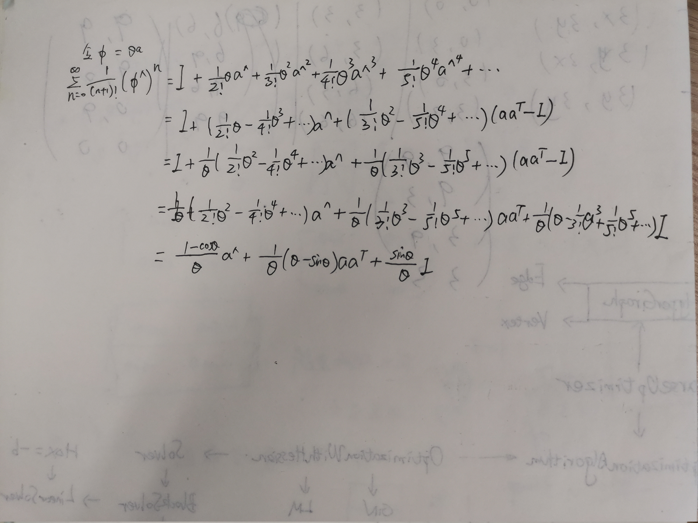
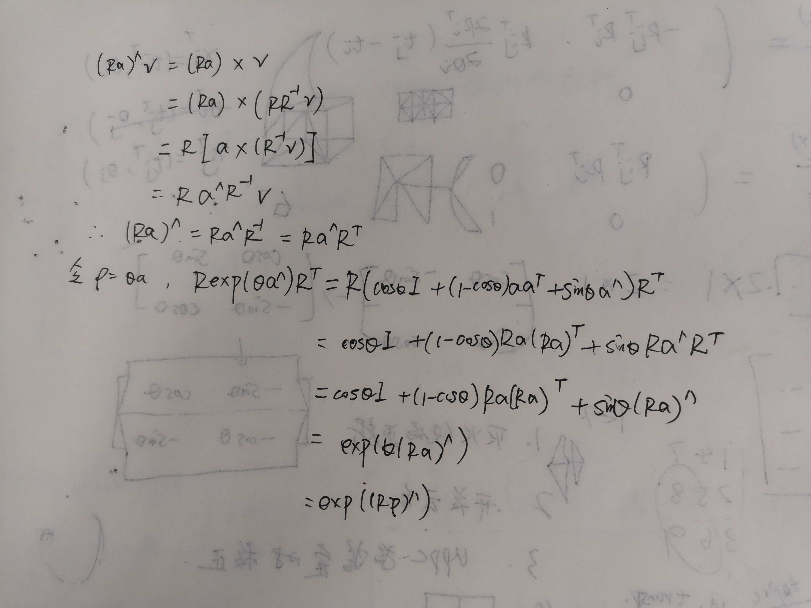
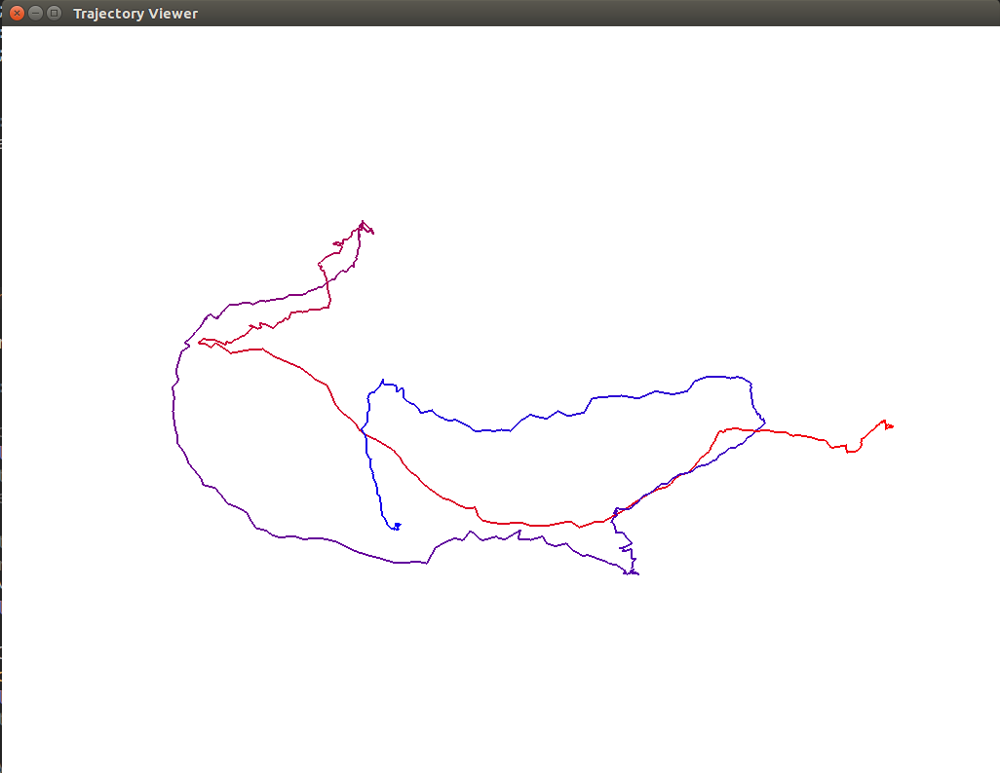
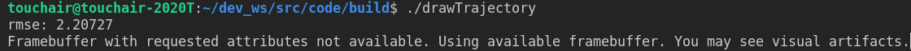
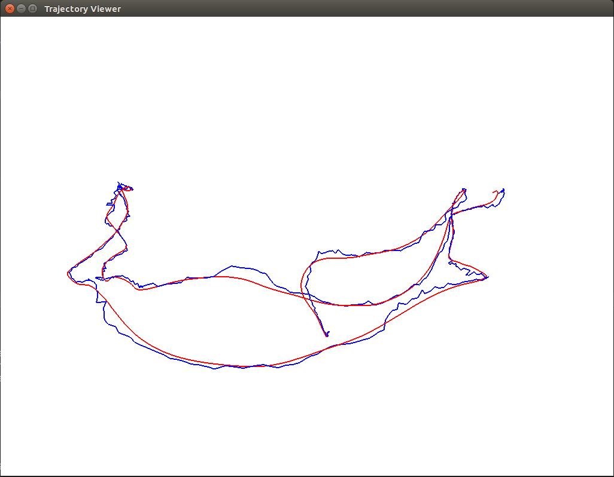

## 第3讲 李群与李代数

2.1 {Z,+}是群
对于∀𝑎1∈𝑍 , 𝑎2∈𝑍, 有a1+𝑎2∈𝑍, 因此满足封闭性。
对于∀𝑎1∈𝑍,𝑎2∈𝑍,𝑎3∈𝑍, (𝑎1+𝑎2)+𝑎3=𝑎1+(𝑎2+𝑎3)，因此满足结合律。
Z中存在0∈𝑍,对于∀𝑎∈𝑍,有a+0=𝑎,因此慢足幺元
对于∀𝑎∈𝑍, 存在 −𝑎∈𝑍, 使得 𝑎+(−𝑎)=0,因此满足逆。

2.2 {𝑁,+}  不是群；
对于∀𝑎∈𝑁，且𝑎≠0,−𝑎∉𝑁,不满足逆的性质要求。因此不是群。
2.3 阿贝尔群 又称交换群或加群，是满足交换律的群。既对任意的a,b∈G,都有ab=ba，则称G为阿贝尔群。矩阵及乘法构成的群不一定是阿贝尔群
3 
封闭性
对于∀𝑋,𝑌∈𝑅3，  𝑋 ×𝑌依然是一个向量，即 𝑋×𝑌∈𝑅3,因此满足封闭性条件。
双线性
对于∀𝑋,𝑌,𝑍∈𝑅3，𝑎,𝑏∈𝑅，向量叉乘运算满足分配律和线性性，因此有：
(𝑎𝑋+𝑏𝑌)×𝑍=𝑎𝑋×𝑍+𝑏𝑌×𝑍=𝑎(𝑋×𝑍)+𝑏(𝑌×𝑍)
𝑍×(𝑎𝑋+𝑏𝑌)=𝑎𝑍×𝑋+𝑏𝑍×𝑌=𝑎(𝑍×𝑋)+𝑏(𝑍×𝑌)
因此满足双线性
自反性
对于 ∀𝑋∈𝑅3,|𝑋×𝑋|=|𝑋||𝑋|𝑠𝑖𝑛0=0，因此 𝑋×𝑋=0,满足自反性。
雅可比等价
把三适量叉乘展开成点乘，向量的叉乘运算满足一下性质：
对于∀𝑋,𝑌,𝑍∈𝑅3，
（ 𝑋×𝑌）×𝑍=(𝑋𝑍)𝑌−(𝑌𝑍)𝑋
 𝑋×(𝑌×𝑍)=(𝑋𝑍)𝑌−(𝑋𝑌)𝑍
因此
 𝑋×(𝑌×𝑍)+𝑌×(𝑍×𝑋)+𝑍×(𝑋×𝑌)=𝑋(𝑌𝑍)−𝑍(𝑋𝑌)+(𝑌𝑋)𝑍−(𝑌𝑍)𝑋+(𝑍𝑌)𝑋−(𝑍𝑋)𝑌=0
因此向量的叉乘运算满足雅可比恒等式。
综上所述，𝑔=(𝑅3,𝑅,×)构成李代数

4

5

7

8

