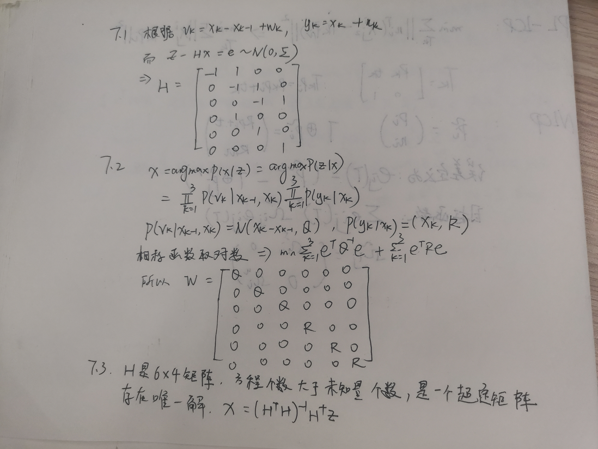

## 第4讲 相机模型与非线性优化

2

3.1 鱼眼镜头与普通镜头相比有更大的视野范围
3.2 普通相机成像遵循的是针孔相机模型，在成像过程中实际场景中的直线仍被投影为图像平面上的直线。但是鱼眼相机如果按照针孔相机模型成像的话，投影图像会变得非常大，当相机视场角达到180°时，图像甚至会变为无穷大。所以，鱼眼相机的投影模型为了将尽可能大的场景投影到有限的图像平面内，允许了相机畸变的存在。并且由于鱼眼相机的径向畸变
非常严重，所以鱼眼相机主要的是考虑径向畸变，而忽略其余类型的畸变。
4

5

6 

7

