## 第5讲 特征点法视觉里程计

2.1-2.3 结果截图如下
特征点如下

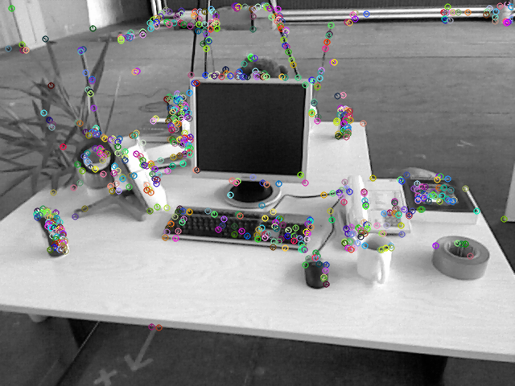

单线程匹配结果如下

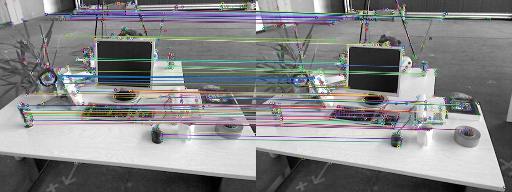

2.4 

多线程运行时间如下

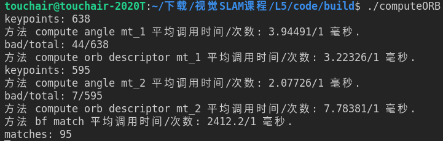

单线程运行时间如下

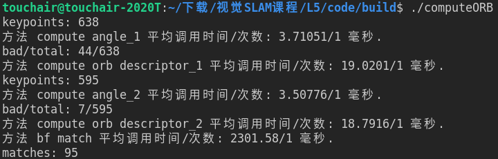

多线程匹配结果如下

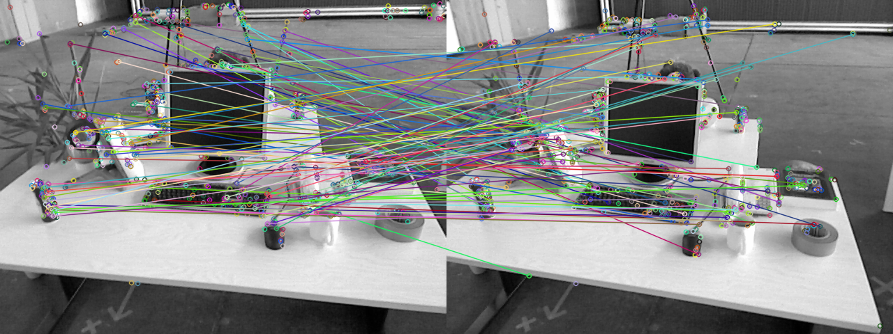

2.4.1
其描述子是以二进制表示的
2.4.2
阈值取得过大会导致误匹配率增加；阈值取得过小会导致匹配对过少。这两种情况会导致后续的位姿求解不稳定。
2.4.3
需要2秒左右，后续可以采用快速最近邻匹配法。
2.4.4
多线程和单线程计算旋转角耗时差不多，计算描述子多线程耗时更短
3 运行结果如下图所示

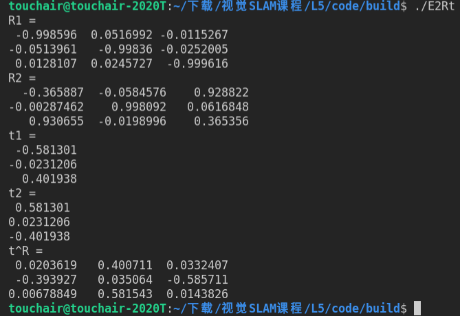

4

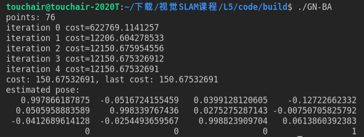

4.1第i个投影点的误差为

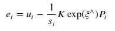

重投影误差如下

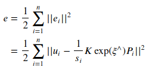

4.2 雅克比矩阵计算如下

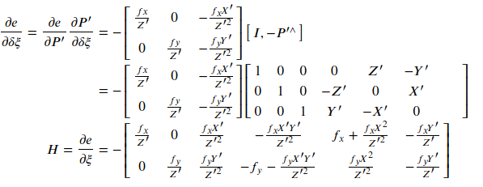

4.3 更新如下

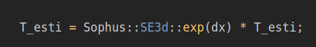

5 对准前后RMSE误差

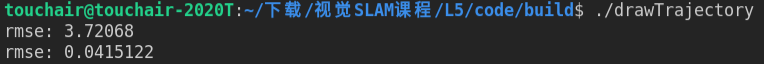

对准前后轨迹

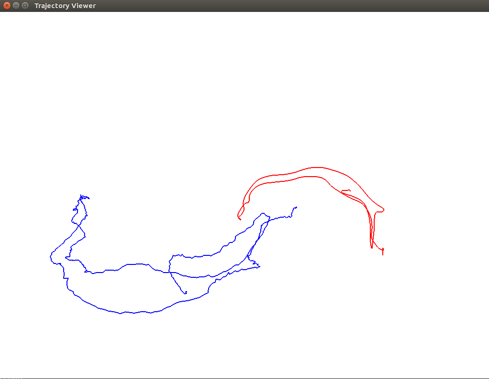

