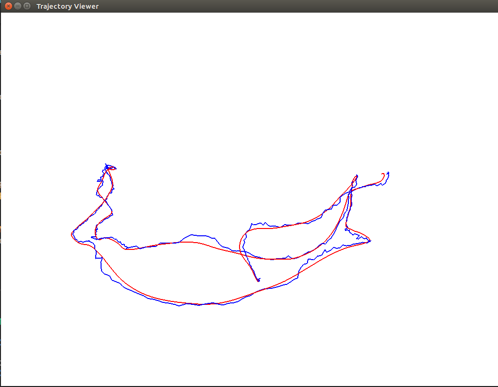

## 第5讲 特征点法视觉里程计

2.1-2.3 结果截图如下
特征点如下

单线程匹配结果如下

2.4 

多线程运行时间如下

单线程运行时间如下

多线程匹配结果如下

2.4.1
其描述子是以二进制表示的
2.4.2
阈值取得过大会导致误匹配率增加；阈值取得过小会导致匹配对过少。这两种情况会导致后续的位姿求解不稳定。
2.4.3
需要2秒左右，后续可以采用快速最近邻匹配法。
2.4.4
多线程和单线程计算旋转角耗时差不多，计算描述子多线程耗时更短
3 运行结果如下图所示

4

4.1第i个投影点的误差为

重投影误差如下

4.2 雅克比矩阵计算如下

4.3 更新如下

5 对准前后RMSE误差

对准前后轨迹

