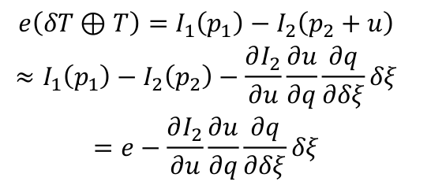
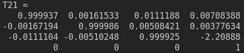

## 第6讲 直接法视觉里程计

2.1.1 按照估计的是参数的叠加增量还是增量Warp将光流法分为叠加(additional)和组合(compositional)算法，按照Warp更新规则可以将光流法分为前向（forward）和逆向(inverse)两种算法
2.1.2 与Lucas-Kanade算法中那样简单地将迭代的更新Δp添加到当前估计的参数p不同，组合（compositional）算法中，对扭曲W(x;Δp)的增量更新必须由Warp的当前估计组成W(x;p)。
2.1.3 forward方法和inverse方法在目标函数上不太一样，一个是把运动向量 p 都是跟着被匹配图像，但是向前方法中的迭代的微小量 Δp 使用 I 计算，反向方法中的 Δp 使用 T计算，这样计算量便小了。
2.2


2.2.1 误差定义如下


2.2.2 误差对于自变量的导数定义如下


图像梯度一般也可以用中值差分：

```
dx(i,j) = [I(i+1,j) - I(i-1,j)]/2;
dy(i,j) = [I(i,j+1) – I(i,j-1)]/2;
```

对应的雅克比矩阵计算如下


2.3 反向的光流法用I1(xi,yi)处的梯度，替换掉原本要计算的I2(xi+∆xi, yi+∆yi)
对应的雅克比矩阵计算如下


2.4 forward


inverse


从结果图看，多层光流与OpenCV效果相当，多层光流强于单层光流

2.4.1 coarse-to-fine是从最粗糙的顶层金字塔开始向下迭代，不断细化估计的过程
2.4.2 特征点法的金字塔主要用于不同层级之间的匹配，以使得匹配对缩放不敏感。光流中金字塔 主要用于 coarse-to-fine的估计
3.1.1 误差项如下


3.1.2 误差相对于自变量的维度是1×6，求解如下




3.1.3 窗口大小的选择和误差以及计算量有关系。窗口不能取太大，随着窗口的增大，两帧之间的关键点的计算量将会呈指数增长；窗口可以取单点。但是这样会导致像素梯度计算误差增大. 单个像素在两张图片里灰度不变的假设太过强烈，使用多个像素有助于提供鲁棒性。

3.1 单层直接法位姿估计如下


3.2 多层直接法位姿估计如下





可以看出多层直接法估计的位姿比单层直接法准确