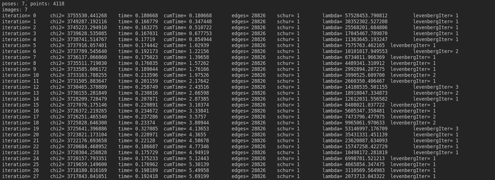

## 第7讲 后端优化

2.1.1 可以利用H矩阵的稀疏性进行优化。
2.1.2 BA中需要被参数化的地方包括：相机位姿、相机内参、三维特征点P以及投影后的像素坐标；
位姿：
欧拉角、四元数、旋转矩阵+平移；
欧拉角存在万向锁问题；
旋转矩阵直观，但自由度过多；
四元数参数简洁，不直观。
Point 参数化方式：
点的参数化表示包括三维坐标XYZ和逆深度表示方法。
2.1.3 3.4节的 Intensity- based methods就是BA在直接法中的应用。第5节 Network Structure可以对应到SLAM中的图优化模型；H的稀疏性可以实现BA实时，在07年的PTAM上实现。
2.2 程序运行如图

初始点云如图

优化后的点云如图

3.1.1

3.1.2 每个error关联两个优化变量，6自由度的相机位姿和3自由度的空间点

3.1.3

3.2.1 可以，还可以使用逆深度的方法来参数化路标点。
3.2.2 太小的patch不能反应真正的光度变化。固定场景的话可能更大ー点好，但会增加运算量。
3.2.3 计算误差的方式不同，特征点法在BA阶段最小化特征点的重投影误差，直接法最小化的是像素点块的光度误差；因此其雅可比计算也不一样。
3.2.4  做多次测验，取误差最小的阈值作为Huber的阈值。
程序运行如下

优化前点云如下

优化后点云如下

