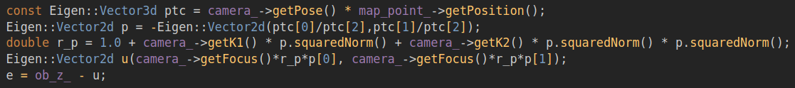
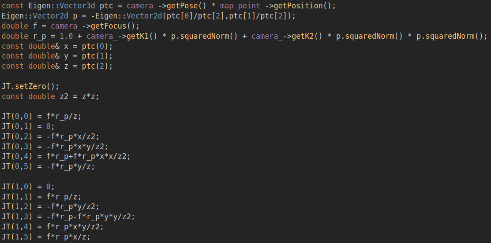
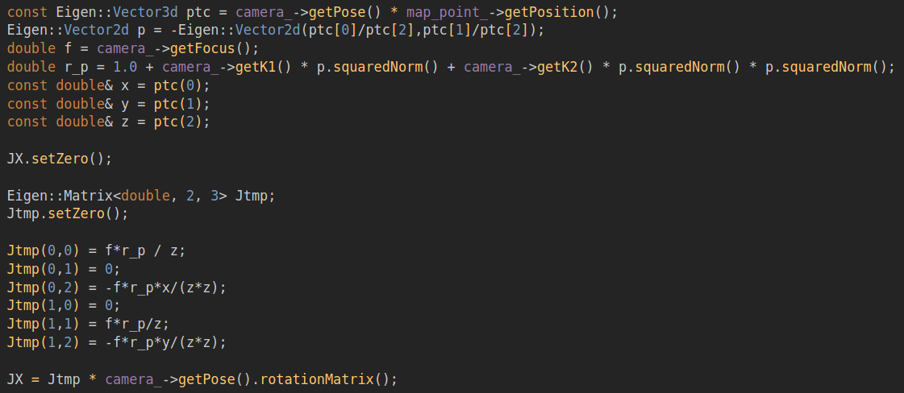
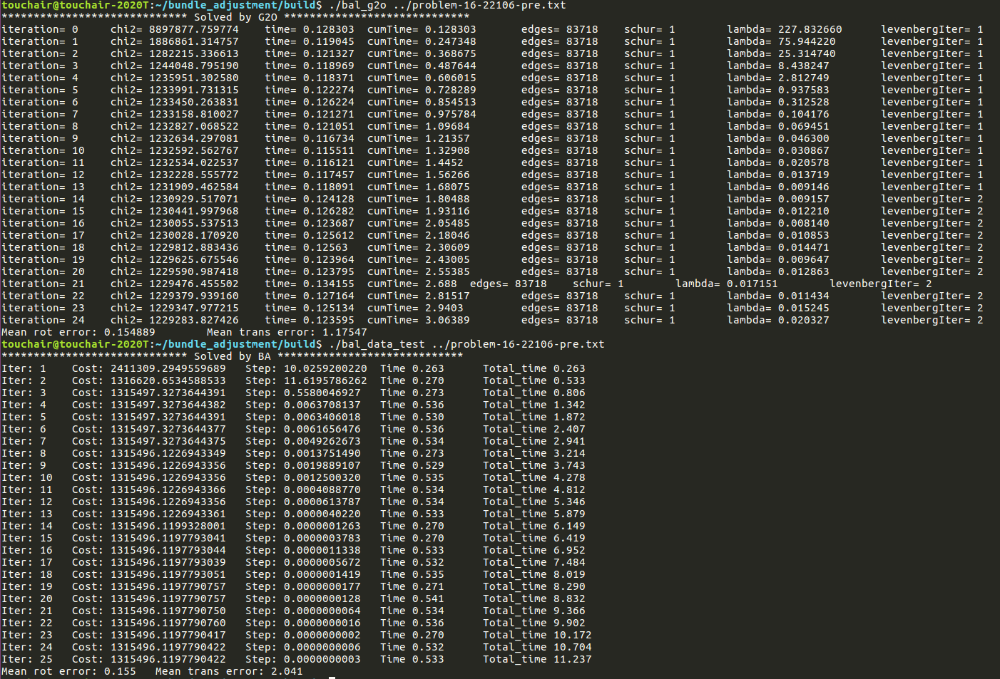
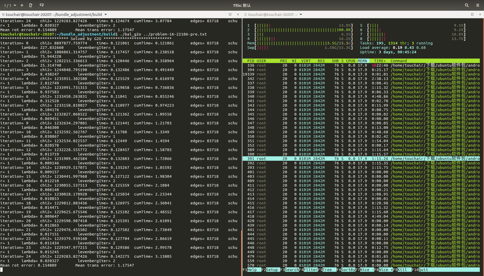
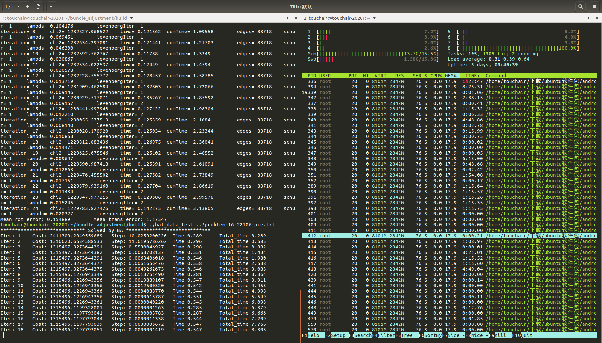

## 选题 4:手写 Bundle Adjustment

1、BAL数据集介绍
16 22106 83718
0 0     -3.859900e+02 3.871200e+02
1 0     -3.844000e+01 4.921200e+02
16为相机个数， 22106为路标个数， 83718为观测数据个数
第一行：0为第0个相机， 0为第0个路标， 后面2个为观测数据，像素坐标，83718后面是相关参数，前面是相机参数有9维：-R(罗德里格斯向量3维)，t(3维),f(相机焦距),k1(畸变参数),k2(畸变参数)。依次对应相机0 – num_cameras，再后面是路标点的空间3D参数。
2、相机模型
P  =  R * X + t       (conversion from world to camera coordinates)//把世界坐标转换为相机坐标
p  = -P / P.z         (perspective division)//相机坐标归一化处理
p' =  f * r(p) * p    (conversion to pixel coordinates)//转换得到像素坐标
r(p) = 1.0 + k1 * ||p||^2 + k2 * ||p||^4.
3、残差和雅克比
3.1 残差

3.2 位姿的雅克比

3.3 3D点的雅克比

4、与g2o对比
只对比了优化相机坐标，固定3D点，如果同时优化3D点，内存消耗过大，程序崩溃

G2O

手写BA

上面是G2O的测试结果，下面是手写BA的测试结果，可以看出精度方面，手写BA和G2O计算的相机位姿旋转误差基本一致，平移误差手写BA略高于G2O，单次迭代时间和总迭代时间手写BA均高于G2O，CPU占用百分比手写BA略低于G2O
